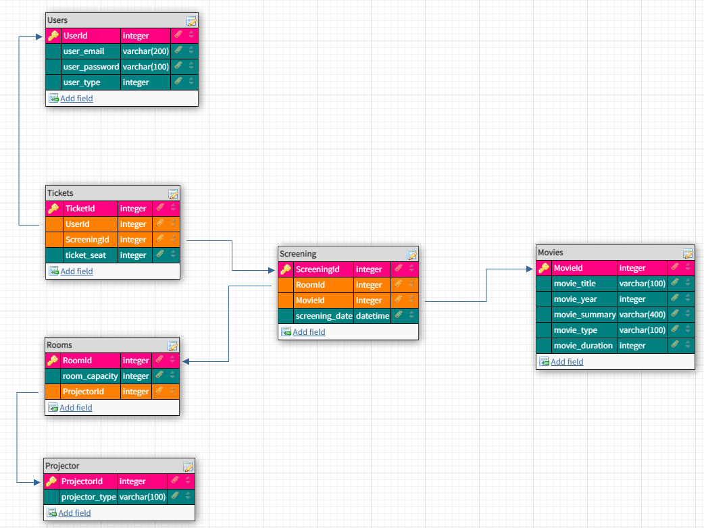

# Cinema

This is a web application created using Angular and NodeJS with a MySQL database.

## Installation
After cloning this repo, you need to install the npm packages for Angular (frontend) and NodeJS (backend).
```sh
$ npm i 
$ npm i ./node-cinema/
```

Then open two terminals and run the next commands, each one in a different terminal. This will start the connection for the client-side and the server-side, respectively.
```sh
$ npm run start
$ cd ./node-cinema/; npm run start; cd ..
```

## Database structure



## Video for Admin flow
[](https://youtu.be/MdNRkOPkOpY)

## Video for User flow
[](https://youtu.be/pBsuo-b8kPs)


